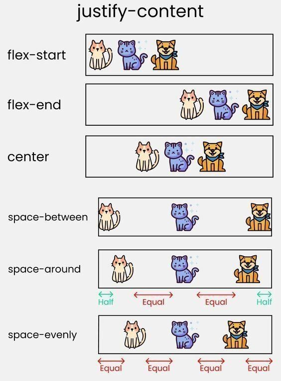

# O que é Flexbox?

O "Flexible Box Model" é um modelo de layout de uma dimensão que proporciona um método para organizar a distribuição espacial e alinhamento.

- Antes do flexbox, os elementos eram alinhados utilizandos _floats_ e _tables_. Flexbox facilitou a vida das pessoas que usam CSS.
- Outra opção, é o uso do _CSS Grid_ para alinhamento/posicionamento. É interessante aprender ambos os métodos.

## Flex container

O container flex é o elemento que abriga itens flex. Os itens flex são filhos diretos dos containers flex. Para criar um container, utilizamos `display: flex;`. A seguir, um exemplo:

```
<div class="flex-container" style="display:flex">
  <div>Flex Item 1</div>
  <div>Flex Item 1</div>
  
</div>
```

### Propriedades do Flex Container

- flex-direction;
- flex-wrap;
- flex-flow;
- justify-content;
- align-items;
- align-content.

### Propriedades do Flex Item

- order;
- flex-grow;
- flex-shrink;
- flex-basis;
- flex-self.

## Eixos

São importantes para definição de algumas propriedades.

- justify-content: alinha no eixo principal;
- align-items: alinha no eixo perpendicular.


## justify-content

Resumo desta propriedade:


